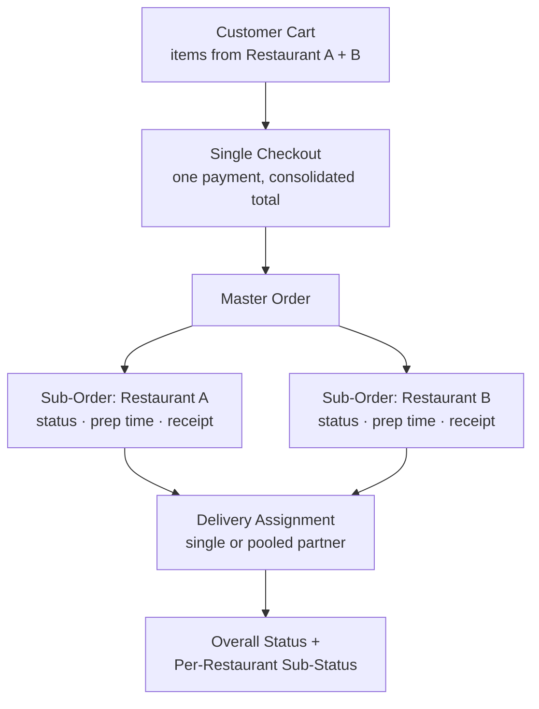

# 📝 Multi-Restaurant Single Checkout — PRD

### A full product requirements document for letting users order from multiple restaurants in one checkout — written as a Zomato-style feature case study

**[📄 Read the full PRD](multi-restaurant-order-prd.md)**

---

## TL;DR

Food delivery apps force a hard constraint: one order, one restaurant. That breaks down the moment a group wants different cuisines, or a family has split preferences. This PRD specs a **multi-restaurant single checkout** — one cart, one payment, one delivery experience, spanning multiple restaurants — while keeping each restaurant's fulfillment, pricing, and status tracking fully independent under the hood.

**What this demonstrates:** structuring an ambiguous "let people order from multiple places" idea into a scoped, phased, buildable feature — with explicit tradeoffs on what's *not* in v1 and why.

---

## 📖 Table of Contents

- [Problem & Objective](#-problem--objective)
- [Scope](#-scope)
- [Order Architecture](#-order-architecture)
- [User Flow](#-user-flow)
- [Requirements at a Glance](#-requirements-at-a-glance)
- [Phased Rollout](#-phased-rollout)
- [Risks & Open Questions](#-risks--open-questions)
- [What This PRD Demonstrates](#-what-this-prd-demonstrates)

---

## 🔍 Problem & Objective

> Customers can currently order from only one restaurant per order — friction for groups wanting different cuisines, families with mixed tastes, or anyone ordering from two nearby places to save a trip.

**Objective:** one consolidated order across multiple restaurants, single checkout, while each restaurant's operations, delivery tracking, and fulfillment stay fully intact behind the scenes.

**Goals:** increase average order value · improve group-order conversion · reduce friction for mixed-menu ordering · increase orders per session · preserve operational transparency for restaurants and delivery partners.

---

## 🎯 Scope

| In Scope (v1) | Explicitly Out of Scope |
|---|---|
| Multi-restaurant cart & checkout | Ghost kitchens / shared food prep |
| Restaurant-level grouping in cart | Cross-restaurant order edits after placement |
| Per-restaurant payment splitting & settlement | Complex refund flows beyond standard per-restaurant handling |
| Delivery assignment (single or pooled) | Multi-restaurant loyalty integration |
| Per-restaurant notifications & receipts | — |
| Separate prep/dispatch timing per restaurant | — |
| Delivery **and** pickup support | — |

Being explicit about what's cut from v1 (ghost kitchens, post-order edits, loyalty integration) was as important as defining what's in — it keeps the phase-1 build scoped to something shippable instead of quietly growing into a much larger project.

---

## 🏗 Order Architecture

The core system decision underpinning every other requirement: **one master order containing independent sub-orders**, each mapped to a restaurant.

This structure is what lets the rest of the PRD stay coherent: pricing, notifications, cancellations, and receipts all key off "master order + N sub-orders" rather than needing separate logic per feature.

---

## 🧭 User Flow

```mermaid
flowchart LR
    A[Browse restaurants] --> B[Add items:\nRestaurant A]
    B --> C[Add items:\nRestaurant B]
    C --> D[Cart groups\nby restaurant]
    D --> E[Review subtotals,\nfees, taxes]
    E --> F[Select address\n& delivery mode]
    F --> G[Choose payment,\ncheck out once]
    G --> H[Master order +\nsub-orders created]
    H --> I[Track overall +\nper-restaurant status]
    I --> J[Delivery & receipts\nper restaurant]
```

---

## 📋 Requirements at a Glance

The full PRD specs 7 functional areas in detail — summarized here:

| Area | Key Requirement |
|---|---|
| **Cart & Catalog** | Groups items by restaurant; blocks adding from closed/out-of-service restaurants |
| **Checkout** | Single page, per-restaurant subtotals, restaurant-specific *and* order-level promo code support |
| **Pricing & Fees** | Calculated per-restaurant (delivery, packaging, tax), consolidated into one total, itemized on receipt |
| **Order Processing** | One master order, independent sub-order statuses, restaurant-level cancellation/refund |
| **Delivery & Logistics** | Partner assignment by proximity/readiness; supports single pooled partner or separate partners per restaurant |
| **Notifications** | Aggregated + per-sub-order updates; explicit guidance when one restaurant is delayed but others aren't |
| **Receipts** | Combined summary + separate per-restaurant receipts, preserving commission/settlement records |

Non-functional requirements cover checkout latency under multi-restaurant load, scalability to a defined max restaurant count per order, graceful partial-failure handling (one restaurant cancels without breaking the order), and PCI-compliant split payment routing.

> Full detail on every requirement: [`multi-restaurant-order-prd.md`](multi-restaurant-order-prd.md)

---

## 🚀 Phased Rollout

| Phase | Delivers |
|---|---|
| **Phase 1** | Core multi-restaurant cart, unified checkout, basic sub-orders, separate status tracking, single delivery partner |
| **Phase 2** | Dynamic delivery routing, advanced promo/loyalty handling, mixed pickup+delivery orders, merchant-facing reporting |
| **Phase 3** | Cross-restaurant combo promotions, scheduled multi-restaurant orders, smart complementary-restaurant suggestions |

**Success metrics:** multi-restaurant cart conversion rate · AOV vs. single-restaurant orders · cart abandonment rate · time-to-checkout · multi-restaurant cancellation rate · group-ordering NPS.

---

## ⚠️ Risks & Open Questions

| Risk | Mitigation |
|---|---|
| Complex fee presentation confuses users | Simplify UI; lead with "single checkout, multiple restaurants" messaging |
| One restaurant's delay drags down the whole order | Surface per-restaurant ETAs; allow partial handoff tracking |
| Item/restaurant-level cancellation ruins the experience | Easy refunds, alternative suggestions, clear in-app communication |
| Settlement complexity across multiple vendors | Clear sub-order accounting reusing existing restaurant payout flows |

**Deliberately left open** rather than guessed at: max restaurants per order, whether delivery and pickup restaurants can mix in one order, which restaurant-level offers carry into the flow, and whether the charge appears as one transaction or multiple captures. Flagging these explicitly — instead of picking arbitrary answers — is itself a scoping decision: they need input from payments, ops, and legal before Phase 1 can be finalized.

---

## 🎓 What This PRD Demonstrates

- **Scoping an ambiguous idea into a buildable v1** — explicit in/out-of-scope lists, not just a feature wishlist
- **System-level thinking, not just UI requirements** — the master-order/sub-order architecture is the decision that makes pricing, cancellation, and tracking all consistent
- **Planning for partial failure** — one restaurant cancelling or running late is treated as an expected case, not an edge case bolted on later
- **Knowing what not to answer yet** — open questions are surfaced for the right stakeholders rather than resolved with unilateral assumptions
- **Phased delivery thinking** — separating "must ship" from "makes it great" from "makes it smart"

---

I'm a **Chemical Engineer transitioning into AI Product Management**, writing PRDs like this one to practice turning ambiguous product problems into scoped, buildable specs.

📂 More case studies and projects on my [GitHub profile](https://github.com/Rehansheikh787).

