<p align="center">
  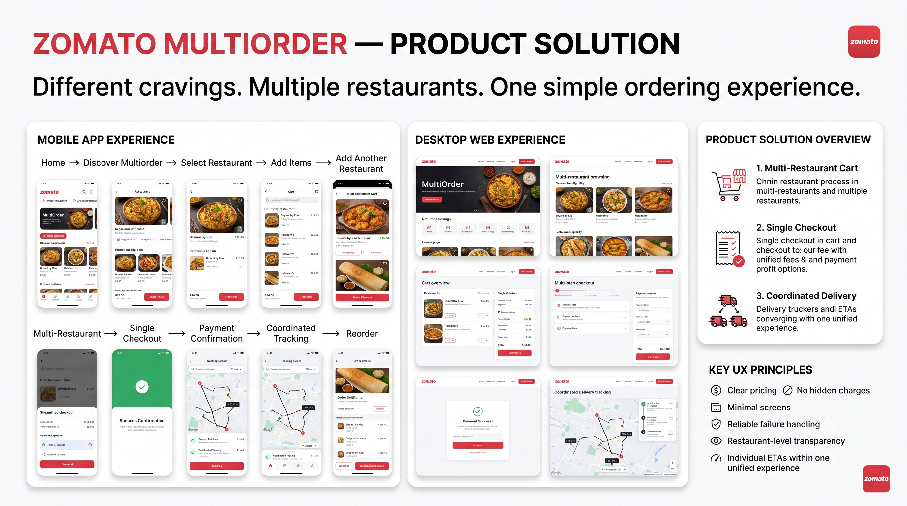
</p>

<h1 align="center">Zomato Multiorder — PRD Case Study</h1>

<p align="center">
  <strong>Different cravings. Multiple restaurants. One ordering experience.</strong>
</p>

<p align="center">
  
  
  
  
</p>

---

## About This Project

This is a **product management case study** I built during a Sunday Workshop focused on solving a real problem in food delivery: the inability to order from multiple restaurants in a single flow.

I picked Zomato as the product context because the constraint is real — you can't combine items from two restaurants into one order, even when they're 200 meters apart. The result? Families settle for one place, groups compromise, and Zomato leaves money on the table.

This repo contains the full PRD I wrote, the prototypes I designed, and the thinking process behind both.

> **Note:** This is a case study and concept exploration. I don't work at Zomato — this is my take on how I'd approach the problem as a PM.

---

## Table of Contents

- [The Problem](#the-problem)
- [Solution Overview](#solution-overview)
- [Visual Case Study](#visual-case-study)
- [Prototype Screens](#prototype-screens)
- [How I Used AI in This Process](#how-i-used-ai-in-this-process)
- [Repository Structure](#repository-structure)
- [Documents](#documents)
- [Built With](#built-with)
- [Author](#author)

---

## The Problem

Customers on Zomato can only order from **one restaurant per order**. This seems fine until you hit these scenarios:

| Scenario | What Happens Today | What Should Happen |
|---|---|---|
| 👨‍👩‍👧‍👦 Family dinner — dad wants biryani, kids want pizza | 2 separate orders, 2 delivery fees, 2 tracking screens | One cart, one checkout, one delivery |
| 👫 Friends ordering together — different cravings | Someone compromises or everyone orders individually | Add from multiple places, split or combine payment |
| 🧑‍💻 Solo user — biryani + ice cream from the dessert shop next door | Two orders for two places 200m apart | One delivery partner picks up both |

**The result:** lower average order value, higher drop-off for group orders, and missed revenue from second-restaurant additions.

---

## Solution Overview

Three capabilities, built in sequence (each depends on the one before):

### 1. Multi-Restaurant Cart `P0`
Add items from 2-3 nearby restaurants into one unified cart. Restaurants must be within a proximity threshold (~300-400m) to qualify as "Multiorder Eligible."

### 2. Single Checkout `P1`
One payment covers all restaurants. Fee breakdown is fully transparent — you see exactly what each restaurant charges plus a bundled (discounted) delivery fee.

### 3. Coordinated Delivery `P2`
One delivery partner handles multi-stop pickup. Tracking screen shows parallel prep status per restaurant with a combined ETA.

---

## Visual Case Study

<details>
<summary><strong>🎯 Problem & User Persona</strong> — Click to expand</summary>
<br>

<br><br>

**Primary persona: Rohan Sharma** — 26, Tech Analyst, Bangalore. Orders multiple times a week, frequently for friends/family. His biggest pain: "Ordering for family is painful" because everyone wants something different.

</details>

<details>
<summary><strong>🗺️ Customer Journey Map</strong> — Click to expand</summary>
<br>

<br><br>

Mapped across 5 stages with pain points, touchpoints, and opportunities at each phase. Key insight: the biggest friction is at **Onboarding** (first multiorder) and **Retention** (managing multiple arrival times).

</details>

<details>
<summary><strong>📊 Competitive Insights & Prioritization</strong> — Click to expand</summary>
<br>

<br><br>

Compared Zomato vs Swiggy vs EatSure across 7 capabilities. Key insight: Zomato already supports multiple carts — the opportunity is to **unify** them into a coordinated experience. RICE prioritization drives the P0 → P1 → P2 build sequence.

</details>

---

## Prototype Screens

I designed both mobile and web prototypes using [Google Stitch](https://stitch.withgoogle.com/). Each screen maps to a specific step in the user flow.

### 📱 Mobile App Flow (7 Screens)

`Home → Intro → Select Restaurant → Browse Menu → Multi-Cart → Checkout → Track`

<table>
  <tr>
    <td align="center" width="25%">
      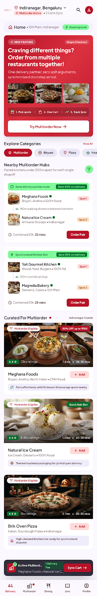<br>
      <sub><strong>Home Discovery</strong><br>P0 — Cart</sub>
    </td>
    <td align="center" width="25%">
      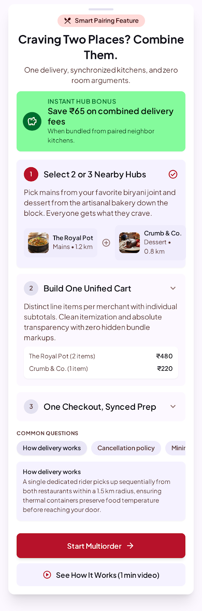<br>
      <sub><strong>Intro Sheet</strong><br>P0 — Cart</sub>
    </td>
    <td align="center" width="25%">
      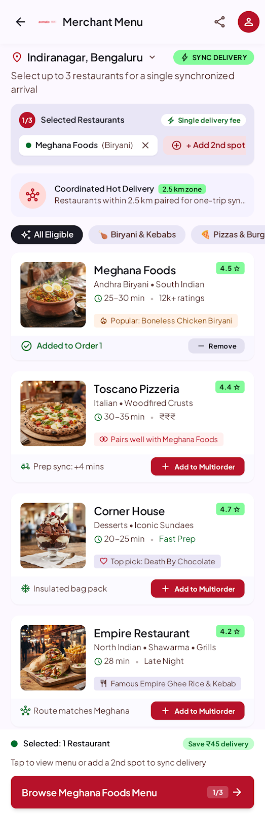<br>
      <sub><strong>Restaurant Selection</strong><br>P0 — Cart</sub>
    </td>
    <td align="center" width="25%">
      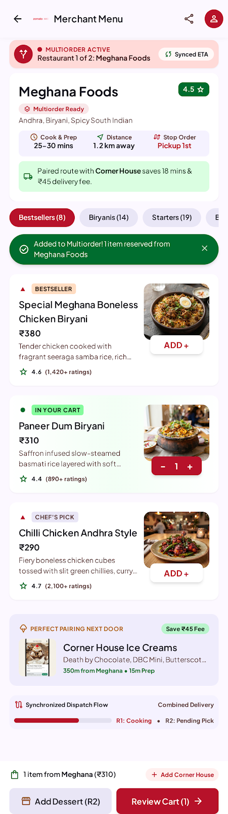<br>
      <sub><strong>Menu Browsing</strong><br>P0 — Cart</sub>
    </td>
  </tr>
  <tr>
    <td align="center">
      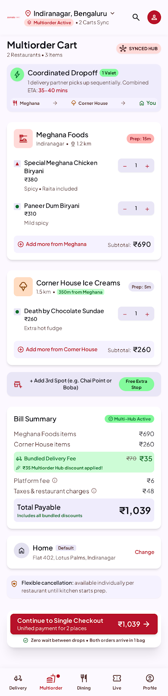<br>
      <sub><strong>Multi-Restaurant Cart</strong><br>P0 — Cart</sub>
    </td>
    <td align="center">
      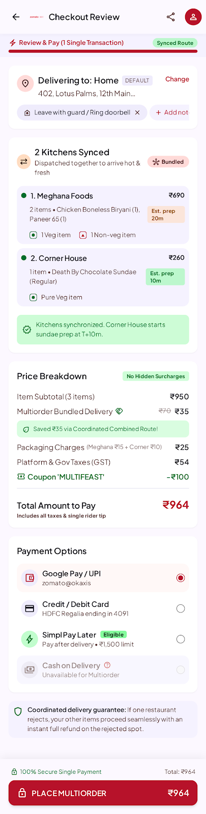<br>
      <sub><strong>Single Checkout</strong><br>P1 — Checkout</sub>
    </td>
    <td align="center">
      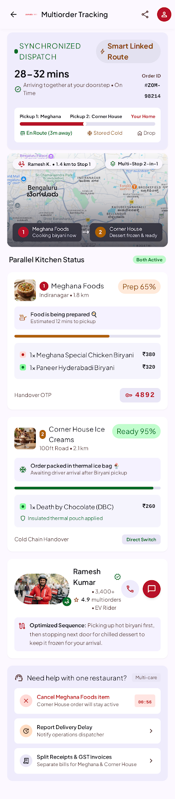<br>
      <sub><strong>Coordinated Tracking</strong><br>P2 — Delivery</sub>
    </td>
    <td></td>
  </tr>
</table>

### 💻 Desktop Web Flow (5 Screens)

`Home → Restaurants → Menu → Checkout → Track`

<table>
  <tr>
    <td align="center" width="50%">
      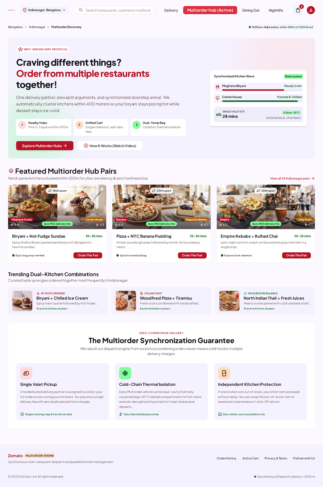<br>
      <sub><strong>Home — Hub Pairs & Combos</strong> · P0</sub>
    </td>
    <td align="center" width="50%">
      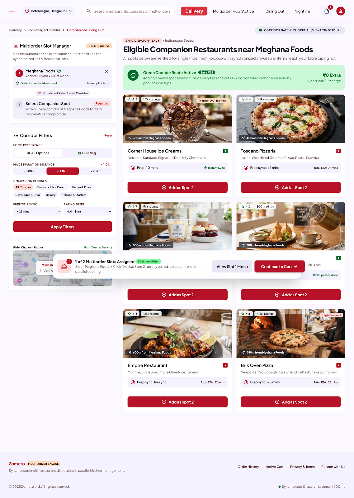<br>
      <sub><strong>Restaurant Discovery</strong> · P0</sub>
    </td>
  </tr>
  <tr>
    <td align="center">
      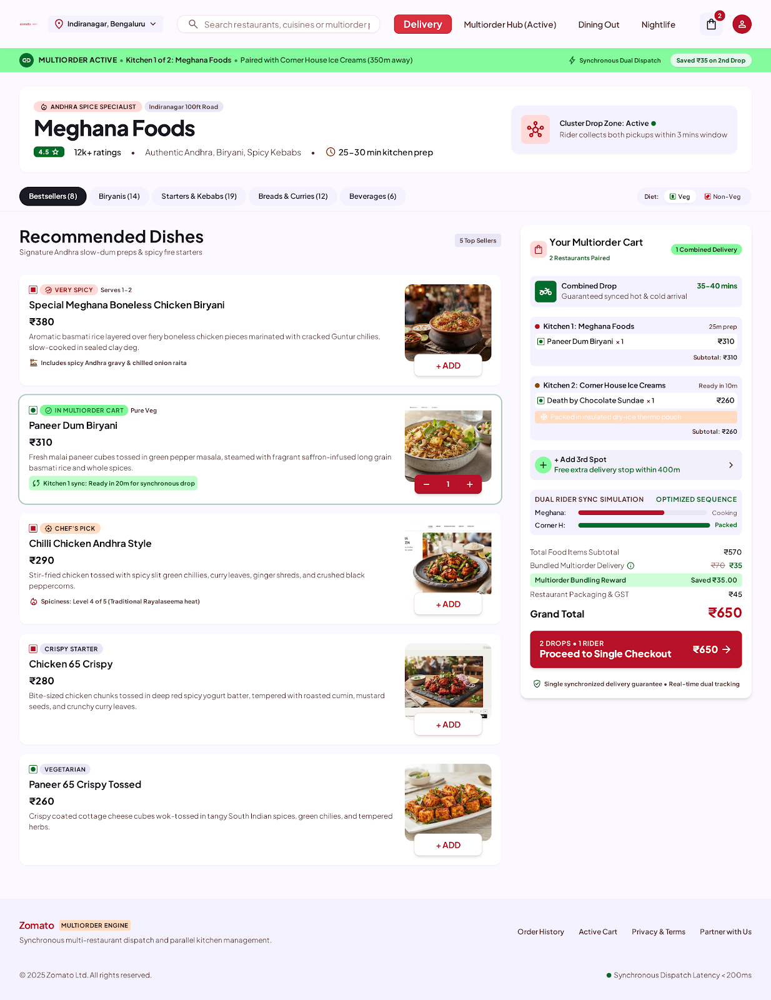<br>
      <sub><strong>Menu with Multiorder Cart</strong> · P0</sub>
    </td>
    <td align="center">
      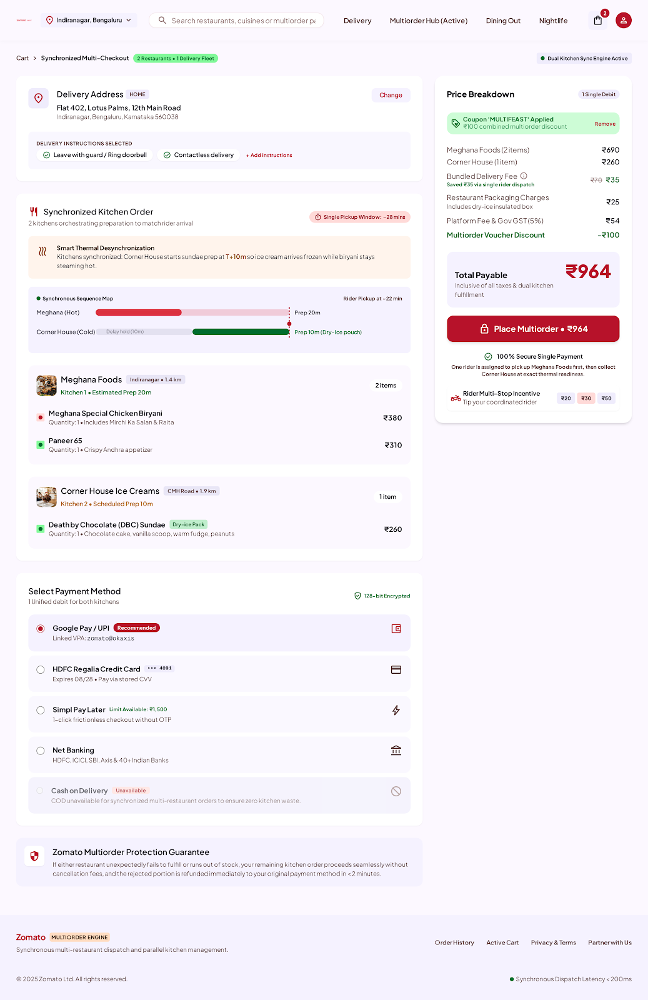<br>
      <sub><strong>Single Checkout</strong> · P1</sub>
    </td>
  </tr>
  <tr>
    <td align="center" colspan="2">
      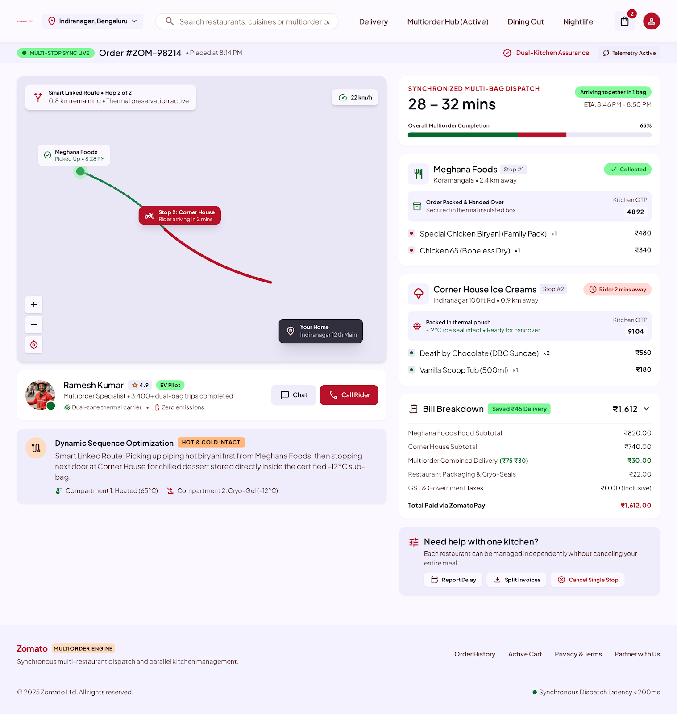<br>
      <sub><strong>Coordinated Delivery Tracking</strong> · P2</sub>
    </td>
  </tr>
</table>

> 🔗 **Interactive prototype gallery:** Open [`docs/prototype-showcase.html`](docs/prototype-showcase.html) locally or via GitHub Pages for a click-through experience with zoom.

---

## How I Used AI in This Process

I used AI (Gemini, Stitch, Antigravity) throughout this project — not to write the PRD for me, but as a **thinking partner** that helped me sharpen, challenge, and visualize my ideas.

My rule: **AI refines, I decide.** Every section started with my own draft or direction. AI helped me:
- Tighten the problem statement language
- Identify non-goals I hadn't considered
- Push back on my metric choices (changed my North Star based on AI feedback)
- Convert product requirements into prototype-ready design prompts
- Structure the competitive analysis systematically

**What I explicitly avoided:** Using AI to generate the core product thinking. The problem framing, persona, journey stages, prioritization, and solution scoping are my work. AI made them clearer, not different.

📄 **Full workflow documentation:** [`prompts/ai-workflow.md`](prompts/ai-workflow.md) — includes the exact prompts I used, why I phrased them that way, and what I changed vs. kept from AI suggestions.

---

## Repository Structure

```
├── README.md                      ← You are here
├── context.md                     ← Product context: problem, persona, journey, competition
├── plan.md                        ← Execution plan: RICE, requirements, metrics, rollout
├── docs/
│   └── prototype-showcase.html    ← Interactive prototype gallery (HTML)
├── assets/
│   ├── screenshots/               ← 4 project overview visuals
│   ├── mobile-prototypes/         ← 7 mobile app screens (PNG)
│   └── web-prototypes/            ← 5 desktop web screens (PNG)
├── prompts/
│   └── ai-workflow.md             ← How AI was used as a PM copilot
├── design-system/
│   └── DESIGN.md                  ← Design tokens from Google Stitch
└── LICENSE
```

---

## Documents

| Document | What It Covers |
|---|---|
| [**context.md**](context.md) | Problem, persona (Rohan Sharma), customer journey, competitive landscape, stakeholders |
| [**plan.md**](plan.md) | Goals, RICE prioritization, phased rollout, functional & non-functional requirements, success metrics, risks |
| [**ai-workflow.md**](prompts/ai-workflow.md) | Full AI-assisted PM workflow with prompt reasoning and decision log |
| [**DESIGN.md**](design-system/DESIGN.md) | Design system tokens — colors, typography, spacing, components |
| [**Prototype Showcase**](docs/prototype-showcase.html) | Interactive HTML gallery of all 12 prototype screens |

---

## Built With

| Tool | Purpose |
|---|---|
| **Google Gemini** | PRD refinement, persona generation, journey mapping, competitive research |
| **Google Stitch** | UI prototype generation — both mobile and web screens |
| **VS Code + Antigravity** | Repository structuring, documentation, portfolio preparation |
| **Markdown** | All documentation written in Markdown for GitHub rendering |

---

## Author

**Rehan Sheikh**

This case study was built as part of a PM workshop focused on writing production-quality PRDs with AI-assisted workflows. It demonstrates:
- Structured product thinking (problem → persona → journey → solution → metrics)
- RICE-driven prioritization with clear build sequencing
- Cross-platform prototyping (mobile + web)
- Transparent AI collaboration methodology

---

<p align="center">
  <sub>Made with ☕ and a Sunday Workshop</sub>
</p>
