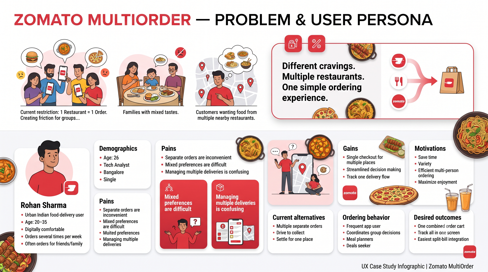
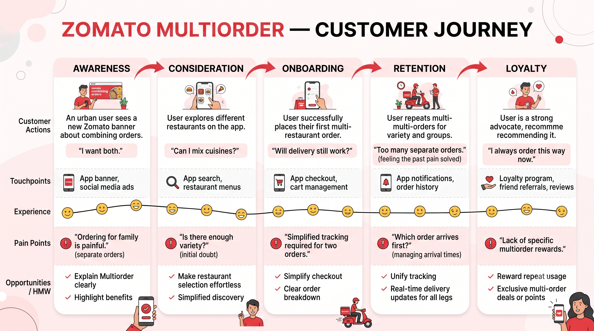
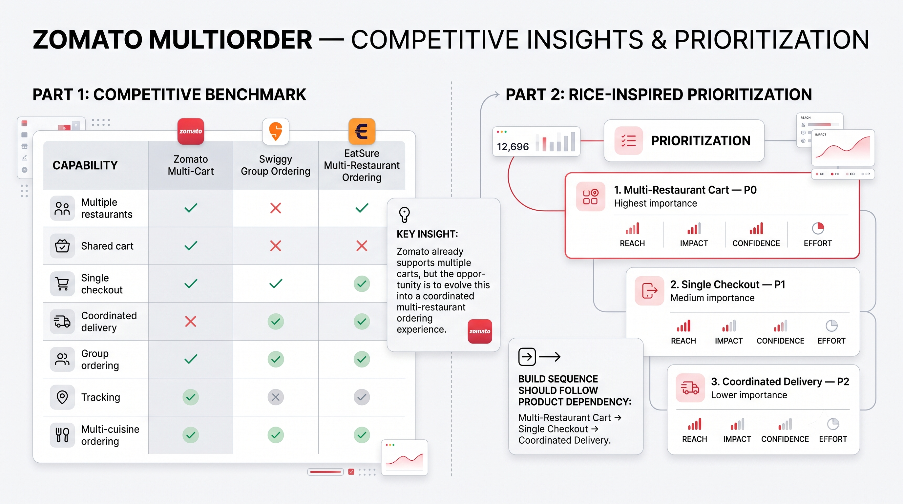

# Zomato Multiorder — Product Context

## Why This Problem Matters

If you've ever ordered food for a group — a family dinner, friends catching up, or even just yourself wanting biryani from one place and ice cream from another — you've hit this wall. Zomato (and most food delivery apps) force you into a **one-restaurant-per-order** model. Want items from two places? Place two separate orders. Pay two delivery fees. Track two deliveries. Hope they arrive roughly at the same time.

That's not just inconvenient — it's a **revenue leak**. Customers who would have ordered from a second restaurant simply don't, because the friction isn't worth it. They settle for one place, or worse, they abandon the order entirely when the group can't agree.

This PRD explores how a **Multiorder feature** could solve this.

---

## Problem Statement

Customers can currently place an order from only one restaurant at a time. This creates friction for groups with different food preferences, families wanting multiple cuisines, or customers who want items from two nearby restaurants in a single outing. As a result, customers must place and manage separate orders, leading to missed or abandoned orders.

The core tension: **Zomato's current architecture treats each order as an isolated transaction, even when the customer's intent is clearly multi-restaurant.**

---

## Who's This For?

### Primary Persona — Rohan Sharma

I built this persona based on real patterns I've observed in urban Indian food delivery behavior.

| Attribute | Detail |
|---|---|
| **Age** | 20–35 |
| **Location** | Bangalore (Indiranagar) |
| **Occupation** | Tech Analyst |
| **Digital comfort** | High — orders multiple times a week |
| **Household** | Lives alone, but frequently orders for friends/family visits |

**His frustrations:**
- "Ordering for family is painful" — everyone wants something different, but he ends up placing 2-3 separate orders
- Mixed preferences across veg/non-veg, different cuisines — settling for one restaurant means someone compromises
- Managing multiple deliveries is confusing — which order arrives first? Are they both coming from the same direction?

**What he actually wants:**
- One combined cart across restaurants
- One checkout, one delivery fee (or at least a reduced combined fee)
- Track everything on one screen

---

## Customer Journey

I mapped the journey across five stages to understand where the friction lives and where the opportunities are:

| Stage | What Happens | Pain Point | Opportunity |
|---|---|---|---|
| **Awareness** | User sees a banner about combining orders. "I want both." | "Ordering for family is painful." | Explain Multiorder clearly, highlight benefits |
| **Consideration** | User explores different restaurants. "Can I mix cuisines?" | "Is there enough variety?" (initial doubt) | Make restaurant selection effortless |
| **Onboarding** | User places their first multi-restaurant order | "Simplified tracking required for two orders." | Simplify checkout, clear order breakdown |
| **Retention** | User repeats multiorders for variety and groups | "Which order arrives first?" (managing arrival times) | Unify tracking, real-time updates for all legs |
| **Loyalty** | User becomes an advocate, recommends it | "Lack of specific multiorder rewards." | Reward repeat usage, exclusive deals |

---

## Competitive Landscape

I looked at what competitors are doing in this space. The short version: **nobody has nailed the full experience yet.**

| Capability | Zomato (Current) | Swiggy | EatSure |
|---|---|---|---|
| Multiple restaurants in one flow | ✅ (separate carts) | ❌ | ✅ |
| Shared/unified cart | ✅ | ❌ | ❌ |
| Single checkout | ✅ | ✅ | ✅ |
| Coordinated delivery | ❌ | ✅ (partial) | ✅ |
| Group ordering | ✅ | ✅ | ✅ |
| Live tracking | ✅ | ❌ (limited) | ✅ (partial) |
| Multi-cuisine ordering | ✅ | ✅ | ✅ |

**Key insight:** Zomato already supports multiple carts, but they're isolated. The opportunity is to evolve this into a coordinated multi-restaurant ordering experience — unified cart, single checkout, and synchronized delivery. No competitor has all three done well.

---

## What the Market Tells Us

- **Group ordering is growing** — especially in tier-1 cities where friend groups, families, and office teams order together frequently
- **Average order value increases** when users can add from multiple restaurants without friction (less "settling" for one place)
- **Delivery logistics are already partially solved** — Zomato's fleet already does multi-stop pickups in some areas. This feature would give that infrastructure a user-facing reason to exist

---

## Stakeholders

| Stakeholder | Interest | Concern |
|---|---|---|
| **Customers** | Convenience, variety, lower combined fees | Complexity, unclear delivery timing |
| **Restaurants** | More orders, exposure to new customers | Preparation sync with other restaurants |
| **Delivery Partners** | Higher earnings per trip (multi-stop) | Route complexity, wait times at multiple pickups |
| **Zomato Ops** | Higher AOV, more orders per session | Dispatch complexity, failure handling |
| **Zomato Business** | Revenue growth, competitive differentiation | Development cost, operational risk |

---

## The Bottom Line

This isn't a "nice to have" feature. It's a structural improvement to how food delivery works for group/multi-preference scenarios. The demand signal is already there (people are placing multiple separate orders), and the infrastructure partially exists (multi-stop delivery). The gap is a **product experience** that ties it all together.

The next document — [plan.md](plan.md) — covers exactly how I'd build this.
